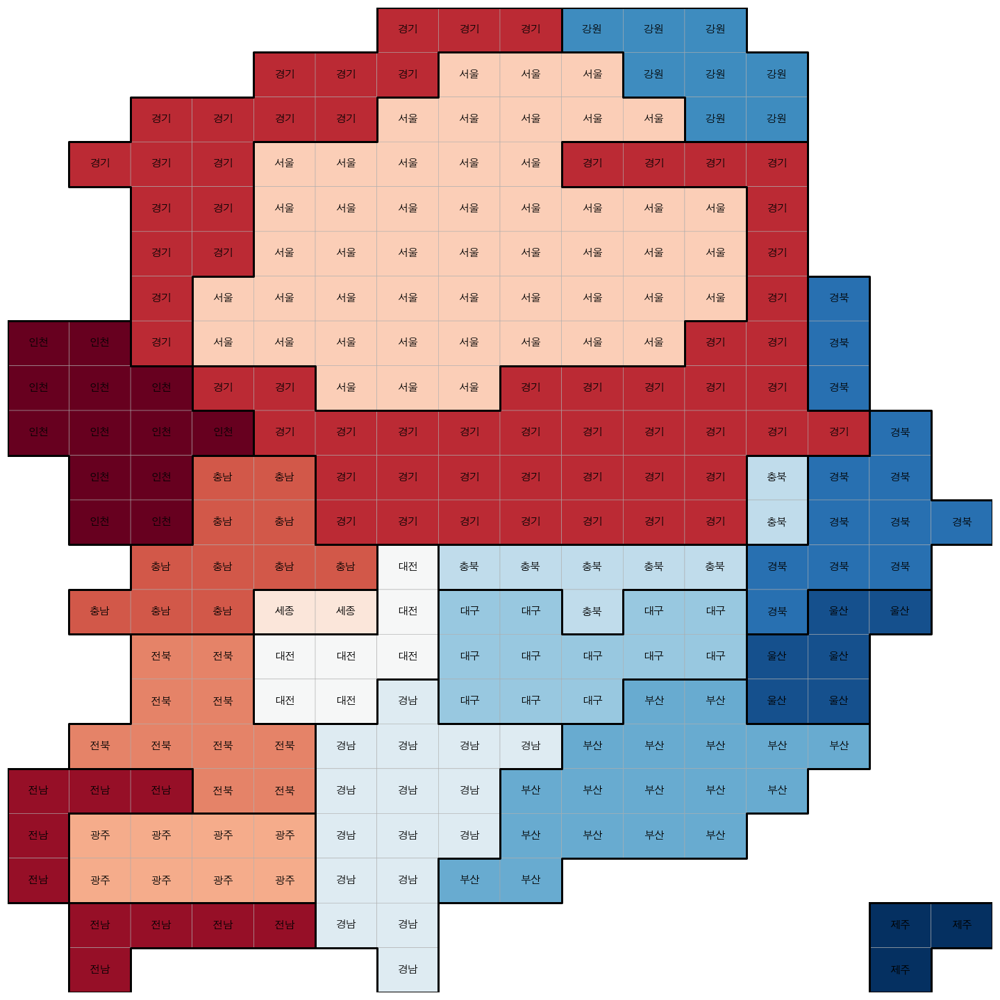

# 21대 총선 데이터 분석

### RESULT


### DATA
- DATA는 아래와 같은 구조로 구성되어있습니다.
  - voter \# 중앙선거관리위원회 선거통계시스템 21대 국회의원 선거 선거인 수
  - korea_map_21th_election_type_b.xlsx \# 21대 선거구 카토그램 파일
  - korea_map_21th_election_type_data.xlsx \# 21대 선거구 카도그램 파일과 당선자 또는 득표 수를 결합하기 위한 데이터 (notebooks/02. 지도 가공.ipynb)
  - korea_map_21th_election_type_display_name.xlsx \# 표시되는 지역구명 개선

```bash
data 
  ㄴvoter/
  ㄴkorea_map_21th_election_type_b.xlsx
  ㄴkorea_map_21th_election_type_data.xlsx
  ㄴkorea_map_21th_election_type_display_name.xlsx
```

